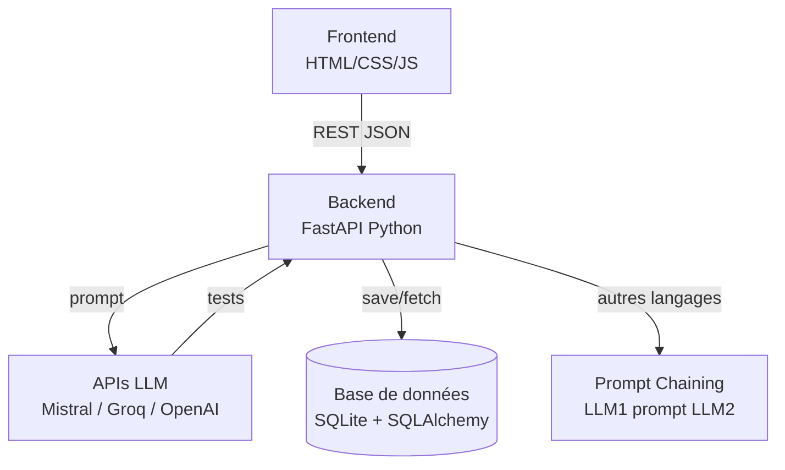
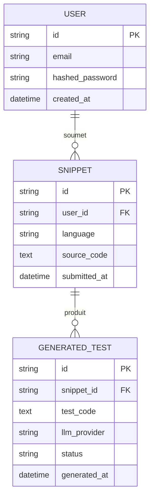

# TestGen AI

> Automatically generate unit tests from your source code using AI.

## Description

TestGen AI is a web application that allows developers to submit Python or JavaScript source code and instantly receive generated unit tests powered by a Large Language Model (LLM).

Built as a portfolio project at Holberton School (C28 — 2026).

## Features (MVP)

- User authentication (JWT)
- Code submission via paste or file upload
- Unit test generation via LLM (Mistral AI / Groq)
- Syntax-highlighted output with one-click copy
- Generation history per user
- Export tests as `.py` / `.js` file

## Tech Stack

| Layer    | Technology                  |
|----------|-----------------------------|
| Backend  | Python, FastAPI, SQLAlchemy |
| Database | SQLite                      |
| Frontend | HTML / CSS / Vanilla JS     |
| Auth     | JWT (python-jose)           |
| LLM      | Mistral AI, Groq (LLaMA 3)  |

## Project Structure

```bash
TestGenAI
├── .env           # your local secrets (never committed)
├── .env.example   # template — copy and fill in
├── .gitignore
├── Makefile
├── README.md
├── requirements.txt
│
├── backend/
│   ├── pytest.ini
│   ├── testgenai.db
│   │
│   ├── app/
│   │   ├── __init__.py
│   │   ├── main.py
│   │   ├── models.py
│   │   │
│   │   ├── routes/
│   │   │   ├── __init__.py
│   │   │   ├── auth.py
│   │   │   ├── generate.py
│   │   │   └── history.py
│   │   │
│   │   └── services/
│   │       └── llm.py
│   │
│   └── tests/
│       ├── conftest.py
│       ├── test_auth.py
│       ├── test_generate.py
│       ├── test_history.py
│       └── test_main.py
│
├── frontend/
│   ├── .babelrc
│   ├── index.html
│   ├── package.json
│   ├── package-lock.json
│   │
│   ├── css/
│   │   └── style.css
│   │
│   ├── js/
│   │   ├── api.js
│   │   ├── app.js
│   │   ├── auth.js
│   │   ├── editor.js
│   │   └── history.js
│   │
│   ├── assets/
│   │   ├── TestGenAI.png
│   │   ├── favicon.ico
│   │   ├── hide.png
│   │   ├── show.png
│   │   │
│   │   └── profile_pics/
│   │       ├── basic.png
│   │       ├── blue.png
│   │       ├── cyan.png
│   │       ├── green.png
│   │       ├── orange.png
│   │       ├── pink.png
│   │       ├── purple.jpg
│   │       ├── red.png
│   │       └── yellow.png
│   │
│   └── tests/
│       ├── api.test.js
│       ├── app.test.js
│       ├── auth.test.js
│       ├── editor.test.js
│       └── history.test.js
│
└── docs/
    ├── ARCHITECTURE.md
    └── SEQUENCES.md
```

## Installation Guide

**1. Clone the repository**
```bash
git clone https://github.com/DaRKkem/TestGenAI.git
cd TestGenAI/
```

**2. Install dependencies**
```bash
make install
```

**3. Configure environment variables**
```bash
make setup
```

Then open `.env` and fill in your keys:

```bash
SECRET_KEY=long_random_key
MISTRAL_API_KEY=your_mistral_key
GROQ_API_KEY=your_groq_key
```
>💡 You can generate a secure secret key with: `python -c "import secrets; print(secrets.token_hex(32))"`  
>Your Mistral and Groq API keys are available on their respective official websites — create a free account if needed.

## Usage

**Start the backend**
```bash
make run-backend
```
The API will be available at `http://127.0.0.1:8000`.  
Interactive docs: `http://127.0.0.1:8000/docs`

**Start the frontend**
```bash
make run-frontend
```
Then open `http://localhost:5500` in your browser.

## Testing

**Backend — pytest (25 tests)**
```bash
cd backend
pytest -v
```

**Frontend — Jest (88 tests)**
```bash
cd frontend
npm test
```

## Architecture



## Database



## Status

✅ MVP complete — Holberton School portfolio project, C28 — 2026

## Author

Damien Rossi — [GitHub](https://github.com/DaRKkem)
