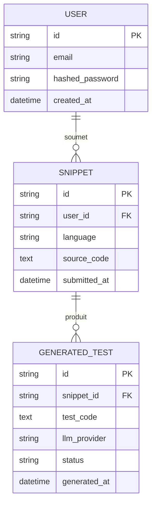
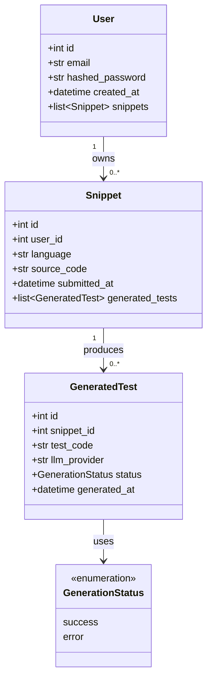
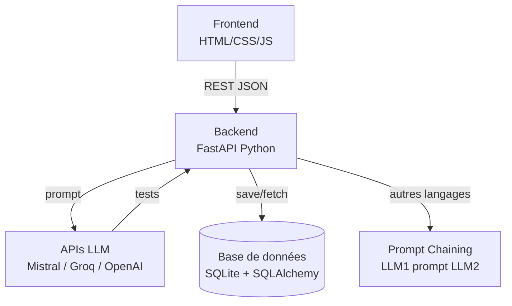

```mermaid
erDiagram
    USER ||--o{ SNIPPET : "soumet"
    SNIPPET ||--o{ GENERATED_TEST : "produit"
    USER {
        string id PK
        string email
        string hashed_password
        datetime created_at
    }
    SNIPPET {
        string id PK
        string user_id FK
        string language
        text source_code
        datetime submitted_at
    }
    GENERATED_TEST {
        string id PK
        string snippet_id FK
        text test_code
        string llm_provider
        string status
        datetime generated_at
    }
```
---

```mermaid
classDiagram
    class User {
        +int id
        +str email
        +str hashed_password
        +datetime created_at
        +list~Snippet~ snippets
    }

    class Snippet {
        +int id
        +int user_id
        +str language
        +str source_code
        +datetime submitted_at
        +list~GeneratedTest~ generated_tests
    }

    class GeneratedTest {
        +int id
        +int snippet_id
        +str test_code
        +str llm_provider
        +GenerationStatus status
        +datetime generated_at
    }

    class GenerationStatus {
        <<enumeration>>
        success
        error
    }

    User "1" --> "0..*" Snippet : owns
    Snippet "1" --> "0..*" GeneratedTest : produces
    GeneratedTest --> GenerationStatus : uses
```
---

```mermaid
graph TD
    A[Frontend\nHTML/CSS/JS] -->|REST JSON| B[Backend\nFastAPI Python]
    B -->|prompt| C[APIs LLM\nMistral / Groq / OpenAI]
    C -->|tests| B
    B -->|save/fetch| D[(Base de données\nSQLite + SQLAlchemy)]
    B -->|autres langages| E[Prompt Chaining\nLLM1 prompt LLM2]
```
