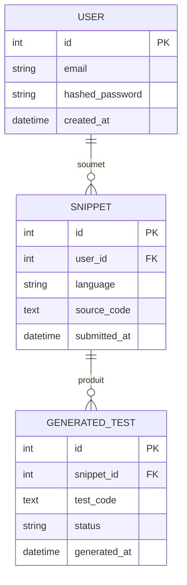
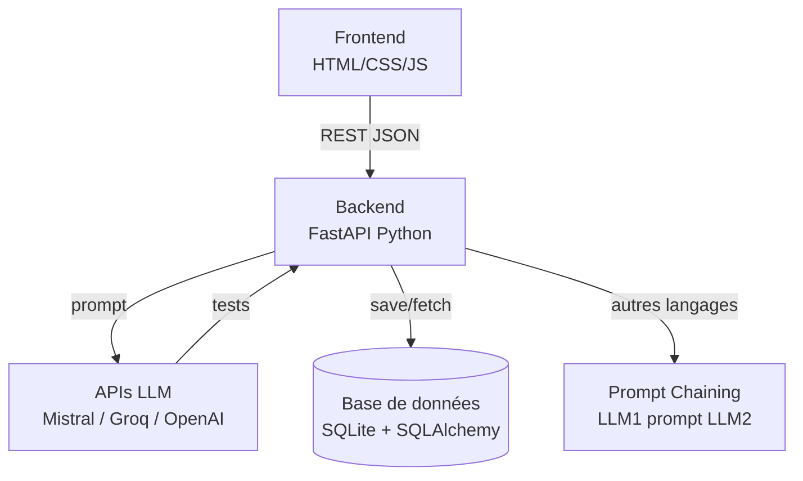

```mermaid
erDiagram
    USER ||--o{ SNIPPET : "soumet"
    SNIPPET ||--o{ GENERATED_TEST : "produit"
    USER {
        int id PK
        string email
        string hashed_password
        datetime created_at
    }
    SNIPPET {
        int id PK
        int user_id FK
        string language
        text source_code
        datetime submitted_at
    }
    GENERATED_TEST {
        int id PK
        int snippet_id FK
        text test_code
        string status
        datetime generated_at
    }
```

```mermaid
graph TD
    A[Frontend\nHTML/CSS/JS] -->|REST JSON| B[Backend\nFastAPI Python]
    B -->|prompt| C[APIs LLM\nMistral / Groq / OpenAI]
    C -->|tests| B
    B -->|save/fetch| D[(Base de données\nSQLite + SQLAlchemy)]
    B -->|autres langages| E[Prompt Chaining\nLLM1 prompt LLM2]
```
