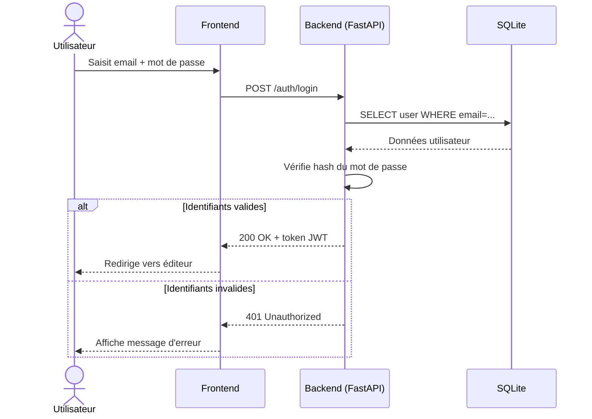
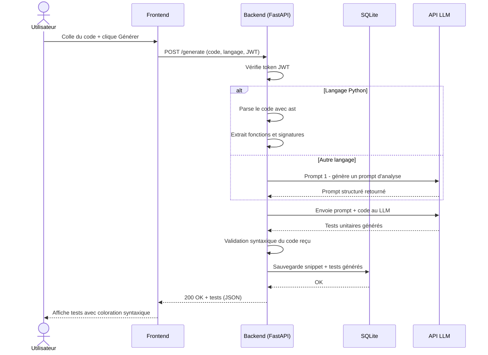
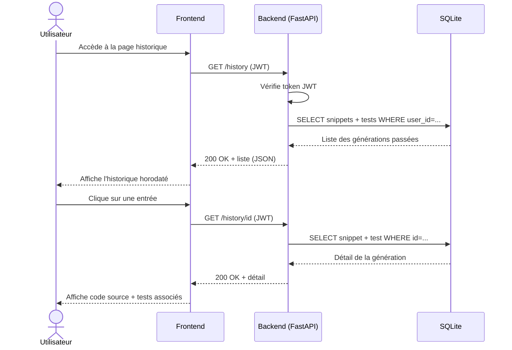

```mermaid
sequenceDiagram
    actor Utilisateur
    participant Frontend
    participant Backend as Backend (FastAPI)
    participant SQLite

    Utilisateur->>Frontend: Saisit email + mot de passe
    Frontend->>Backend: POST /auth/login
    Backend->>SQLite: SELECT user WHERE email=...
    SQLite-->>Backend: Données utilisateur
    Backend->>Backend: Vérifie hash du mot de passe

    alt Identifiants valides
        Backend-->>Frontend: 200 OK + token JWT
        Frontend-->>Utilisateur: Redirige vers éditeur
    else Identifiants invalides
        Backend-->>Frontend: 401 Unauthorized
        Frontend-->>Utilisateur: Affiche message d'erreur
    end
```

```mermaid
sequenceDiagram
    actor Utilisateur
    participant Frontend
    participant Backend as Backend (FastAPI)
    participant SQLite
    participant LLM as API LLM

    Utilisateur->>Frontend: Colle du code + clique Générer
    Frontend->>Backend: POST /generate (code, langage, JWT)
    Backend->>Backend: Vérifie token JWT

    alt Langage Python
        Backend->>Backend: Parse le code avec ast
        Backend->>Backend: Extrait fonctions et signatures
    else Autre langage
        Backend->>LLM: Prompt 1 - génère un prompt d'analyse
        LLM-->>Backend: Prompt structuré retourné
    end

    Backend->>LLM: Envoie prompt + code au LLM
    LLM-->>Backend: Tests unitaires générés
    Backend->>Backend: Validation syntaxique du code reçu
    Backend->>SQLite: Sauvegarde snippet + tests générés
    SQLite-->>Backend: OK
    Backend-->>Frontend: 200 OK + tests (JSON)
    Frontend-->>Utilisateur: Affiche tests avec coloration syntaxique
```

```mermaid
sequenceDiagram
    actor Utilisateur
    participant Frontend
    participant Backend as Backend (FastAPI)
    participant SQLite

    Utilisateur->>Frontend: Accède à la page historique
    Frontend->>Backend: GET /history (JWT)
    Backend->>Backend: Vérifie token JWT
    Backend->>SQLite: SELECT snippets + tests WHERE user_id=...
    SQLite-->>Backend: Liste des générations passées
    Backend-->>Frontend: 200 OK + liste (JSON)
    Frontend-->>Utilisateur: Affiche l'historique horodaté

    Utilisateur->>Frontend: Clique sur une entrée
    Frontend->>Backend: GET /history/id (JWT)
    Backend->>SQLite: SELECT snippet + test WHERE id=...
    SQLite-->>Backend: Détail de la génération
    Backend-->>Frontend: 200 OK + détail
    Frontend-->>Utilisateur: Affiche code source + tests associés
```
